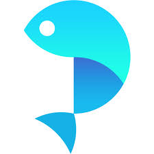
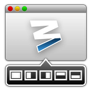

# 推荐应用：1Password Manico 鱼摆摆 Moom Bartender Dash Karabiner

###1Password

####功能：
* 生成推荐账号密码
* 记录已键入的账号密码
* 在页面中填写对应的账号密码
* 打开浏览器跳转网站并填写对应的账号密码

####评价：
使用 Email 与客服沟通，他们会及时处理你的问题并跟进反馈情况。反馈速度很快，服务很赞。『果然歪果仁把 Email 当做即时通讯来用的』。
数据加密，云端存放
iCloud（或Dropbox、本地）。安全上比某免费得还是好太多。**重度依赖**，我 Github 的密码是50位数字加大小写字母。支持 Mac、Windows、iOS、Android。有完善的插件工具包 Alfred、各种浏览器。

---
###Manico 

####功能：
* 使用组合键快速打开/隐藏应用
* 快速切换应用
* Alfred 的轻度替代品

####评价：
提到 Manico 就不得不提 Alfred 。目前看来， Manico 对常用软件的切换操作是要显著超越 Alfred 『默认』的打开方式的。然而，Alfred 的工作流简直太 IMBA，所以如果你买了 Alfred 的 Powerpackage ，请无情无视 Manico。

**如果你不是一个程序员**，不喜欢使用 Alfred 来改善效率，『比如和我合租的设计师妹子』。那么 Manico 将是一个不错的替代品。『然而，同性交友网站 Github 里，真的能有非程序员看到我的这个鬼东西么？』

---
###鱼摆摆

####功能
* 翻墙 Google

####评价
用来代替死去的 [曲径](http://getqujing.com) 。便宜，简单。

---
###Moom 

####功能
* 快速分屏与窗口停靠

####评价
依赖性强，价格便宜。

---
###Bartender 

####功能
* 收纳右上角状态栏图标

####评价
十分棒的处女座治愈工具，可以让右上角的图标收起来。整洁的同时去除掉干扰项。『那些不想回的信息，总算有正当理由了。』

---
###Dash 

####功能
* 文档查询
* 文档导入

####评价
做iOS的时候其实感觉不到，因为Xcode自带了文档工具，查询也很方便。但是当后来开始用 Sublime 写 Python 、 Node 、 Go 之后，才知道了 Dash 的价值。
曾今第三方 Alfred 的 Workflow 完美跳过 Dash 的非注册等待，我却没有好好珍惜。现在 Dash 官方出了 Workflow ，我只好买买买了。
